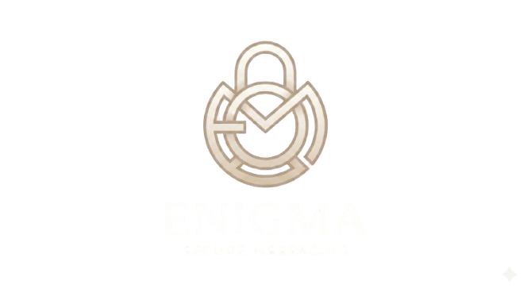

<p align="center">
  
</p>

<h1 align="center">ENIGMA</h1>
<p align="center">
  <strong>Plataforma de Mensajería Anónima, Cifrada y en Tiempo Real</strong><br>
  <em>Cero Correos · Cero Teléfonos · Cero Rastreo · Cifrado AES-256</em>
</p>

<p align="center">
  
  
  
  
</p>

---

## 🔒 Filosofía del Proyecto

**Enigma** es una aplicación de mensajería diseñada para garantizar la privacidad y el anonimato absoluto:
* **Identidad Desacoplada:** Registro exclusivamente mediante `@username` único y contraseña cifrada. Nunca se solicitan ni almacenan correos electrónicos, nombres reales ni números de teléfono.
* **Cifrado en Reposo (AES-256):** Todos los mensajes de texto almacenados en MySQL están encriptados mediante `AES-256-CBC` utilizando la clave de aplicación (`APP_KEY`).
* **Tiempo Real Nativo:** Comunicación instantánea bidireccional mediante **Laravel Reverb (WebSockets)** con canales privados autorizados.
* **Diseño Exclusivo:** Interfaz Cyber-Editorial basada en una paleta minimalista de 4 tonos (*Off-White, Ivory, Nude, Obsidian*) y 100% libre de emojis (iconos vectoriales SVG limpios).

---

## 🌟 Características Principales

- 💬 **Chats Directos (1 a 1):** Búsqueda reactiva por `@username` para iniciar conversaciones cifradas sin duplicar hilos.
- 👥 **Grupos Anónimos:** Creación de salas grupales con múltiples identidades anónimas.
- 🎙️ **Notas de Voz:** Grabación nativa de audio de alta fidelidad y compresión WebM/Opus.
- 📎 **Archivos Adjuntos:** Envío de imágenes, PDFs y documentos con lista blanca MIME y límite de 25 MB.
- 🖼️ **Fotos de Perfil Personalizadas:** Soporte para avatares generados proceduralmente (DiceBear) o enlace directo (URL).
- 🛡️ **Seguridad por Capas:**
  - Protección contra ataques de fuerza bruta en login (`5 intentos/min`).
  - Límite de creación de cuentas (`3 cuentas/min por IP`).
  - Limitador anti-spam en envío de mensajes (`30 mensajes/min`).
  - Middleware de cabeceras HTTP seguras (`X-Frame-Options`, `X-Content-Type-Options`, `X-XSS-Protection`, `Referrer-Policy`, `Permissions-Policy`).

---

## 🛠️ Stack Tecnológico

* **Backend:** PHP 8.5+ & Laravel 13
* **Base de Datos:** MySQL 8
* **WebSockets:** Laravel Reverb & Laravel Echo
* **Frontend:** Blade, Vanilla CSS Custom Design System, JavaScript Vanilla (SPA architecture)
* **Testing:** PHPUnit (Feature & Unit Tests)

---

## 🚀 Instalación y Puesta en Marcha

### 1. Clonar el Repositorio
```bash
git clone https://github.com/Jhan-ux/app_mensajeria.git
cd app_mensajeria
```

### 2. Instalar Dependencias
```bash
composer install
npm install
```

### 3. Configuración de Entorno
Copia el archivo de ejemplo y genera la clave de aplicación:
```bash
cp .env.example .env
php artisan key:generate
```

Configura tus credenciales de MySQL en el archivo `.env`:
```env
DB_CONNECTION=mysql
DB_HOST=127.0.0.1
DB_PORT=3306
DB_DATABASE=app_mensajeria
DB_USERNAME=root
DB_PASSWORD=
```

### 4. Migraciones y Enlace de Almacenamiento
```bash
php artisan migrate
php artisan storage:link
```

### 5. Iniciar los Servidores
En dos terminales separadas:

**Terminal 1 — Servidor Web:**
```bash
php artisan serve
```

**Terminal 2 — Servidor de WebSockets (Reverb):**
```bash
php artisan reverb:start
```

Abre tu navegador en `http://localhost:8000`.

---

## 🧪 Ejecución de Pruebas Automatizadas

Para ejecutar la suite completa de pruebas:
```bash
php artisan test
```

---

## 📄 Documentación Técnica

Toda la documentación detallada se encuentra en la carpeta [`documentacion/`](documentacion/):
* `00_README.md`: Visión y principios de diseño.
* `01_ARQUITECTURA_Y_STACK.md`: Diagrama de componentes y flujo de datos.
* `02_BASE_DE_DATOS_MODELO_ER.md`: Esquema entidad-relación y tablas.
* `03_EVENTOS_Y_WEBSOCKETS.md`: Especificación de canales y eventos Reverb.
* `04_ENDPOINTS_API_Y_RUTAS.md`: Catálogo completo de endpoints REST.
* `05_ROADMAP_Y_FASES_DESARROLLO.md`: Fases y roadmap.
* `06_SEGURIDAD_Y_PROTECCION.md`: Auditoría y capas de defensa en profundidad.

---

<p align="center">
  <em>Desarrollado con arquitectura sólida, privacidad intransigente y estética premium.</em>
</p>
