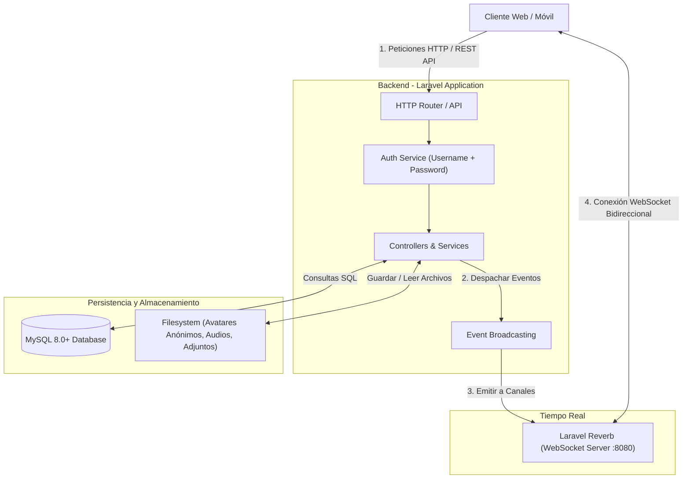

# 🏗️ 01. Arquitectura y Stack Tecnológico (Mensajería Anónima)

Este documento define la arquitectura técnica del sistema, los componentes involucrados y el flujo de comunicación con enfoque en anonimato y privacidad.

---

## 1. Diagrama de Arquitectura del Sistema

---

## 2. Enfoque de Seguridad y Privacidad Anónima

* **Credenciales Simples y Directas:** No se solicita correo electrónico, número de teléfono ni nombres reales. Solo un identificador único (`username`) y una clave encriptada con `bcrypt`/`argon2`.
* **Sin Recuperación Invasiva:** Al ser una plataforma anónima, no hay correos de verificación. Opcionalmente se puede generar una clave de recuperación o frase secreta durante el registro si el usuario lo desea.
* **Búsqueda por `@username`:** La interacción entre usuarios se realiza buscando exclusivamente el `@nombre_de_usuario`.

---

## 3. Justificación del Stack Tecnológico

| Componente | Tecnología | Justificación |
| :--- | :--- | :--- |
| **Backend Framework** | **Laravel 11/12** | Marco de trabajo robusto, seguro, con ORM Eloquent, soporte nativo de WebSockets (Reverb), eventos, colas y migraciones estructuradas. |
| **Motor de Base de Datos** | **MySQL 8.0+** | Base de datos relacional con índices únicos en `username` para búsquedas inmediatas y consistencia transaccional. |
| **Servidor WebSocket** | **Laravel Reverb** | Servidor de WebSockets oficial y nativo de Laravel. Ultrarrápido, de baja latencia y sin costos de terceros. |
| **Cliente de WebSockets** | **Laravel Echo + Pusher.js** | Biblioteca cliente estándar para suscribirse a canales privados y de presencia de manera limpia en Javascript. |
| **Almacenamiento de Archivos** | **Laravel Storage (Local / S3)** | Gestión de subida de imágenes, notas de voz (`.webm`/`.mp3`), archivos y documentos con nombres hash anónimos. |
| **Autenticación** | **Laravel Sanctum** | Autenticación basada en sesiones seguras o tokens API vinculados al `username`. |
