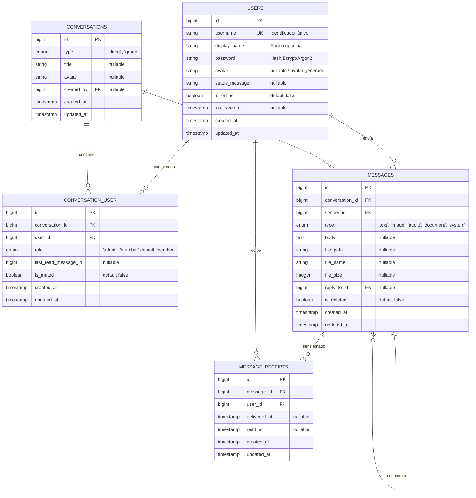

# 🗄️ 02. Base de Datos y Modelo Entidad-Relación (MySQL) - Modelo Anónimo

Este documento contiene la estructura detallada de las tablas de la base de datos MySQL, adaptadas para un sistema de **mensajería anónima** donde la única credencial de acceso es el `username` (único) y la contraseña.

---

## 1. Diagrama Entidad-Relación (DER)



---

## 2. Detalle de Tablas y Definición SQL

### Tabla: `users` (Anónima)
Almacena las credenciales y el perfil anónimo del usuario.
```sql
CREATE TABLE users (
    id BIGINT UNSIGNED AUTO_INCREMENT PRIMARY KEY,
    username VARCHAR(50) NOT NULL UNIQUE, -- Credencial única para login y búsqueda
    display_name VARCHAR(100) NULL,       -- Nombre visual (por defecto igual al username)
    password VARCHAR(255) NOT NULL,       -- Hash seguro
    avatar VARCHAR(255) NULL,             -- URL/Ruta a avatar o ilustración anónima
    status_message VARCHAR(255) DEFAULT 'Disponible',
    is_online BOOLEAN DEFAULT FALSE,
    last_seen_at TIMESTAMP NULL,
    remember_token VARCHAR(100) NULL,
    created_at TIMESTAMP NULL,
    updated_at TIMESTAMP NULL,
    INDEX idx_users_username (username),
    INDEX idx_users_is_online (is_online)
) ENGINE=InnoDB DEFAULT CHARSET=utf8mb4 COLLATE=utf8mb4_unicode_ci;
```

---

### Tabla: `conversations`
Representa una conversación, ya sea directa (1 a 1) o grupal.
```sql
CREATE TABLE conversations (
    id BIGINT UNSIGNED AUTO_INCREMENT PRIMARY KEY,
    type ENUM('direct', 'group') NOT NULL DEFAULT 'direct',
    title VARCHAR(150) NULL, -- Nombre del grupo si type = 'group'
    avatar VARCHAR(255) NULL, -- Foto/icono del grupo si type = 'group'
    created_by BIGINT UNSIGNED NULL,
    created_at TIMESTAMP NULL,
    updated_at TIMESTAMP NULL,
    FOREIGN KEY (created_by) REFERENCES users(id) ON DELETE SET NULL,
    INDEX idx_conversations_type (type)
) ENGINE=InnoDB DEFAULT CHARSET=utf8mb4 COLLATE=utf8mb4_unicode_ci;
```

---

### Tabla Pivote: `conversation_user`
Relaciona a los usuarios que forman parte de cada conversación.
```sql
CREATE TABLE conversation_user (
    id BIGINT UNSIGNED AUTO_INCREMENT PRIMARY KEY,
    conversation_id BIGINT UNSIGNED NOT NULL,
    user_id BIGINT UNSIGNED NOT NULL,
    role ENUM('admin', 'member') NOT NULL DEFAULT 'member',
    last_read_message_id BIGINT UNSIGNED NULL,
    is_muted BOOLEAN DEFAULT FALSE,
    created_at TIMESTAMP NULL,
    updated_at TIMESTAMP NULL,
    FOREIGN KEY (conversation_id) REFERENCES conversations(id) ON DELETE CASCADE,
    FOREIGN KEY (user_id) REFERENCES users(id) ON DELETE CASCADE,
    UNIQUE KEY uq_conversation_user (conversation_id, user_id),
    INDEX idx_user_conversations (user_id, conversation_id)
) ENGINE=InnoDB DEFAULT CHARSET=utf8mb4 COLLATE=utf8mb4_unicode_ci;
```

---

### Tabla: `messages`
Almacena los mensajes enviados en las conversaciones.
```sql
CREATE TABLE messages (
    id BIGINT UNSIGNED AUTO_INCREMENT PRIMARY KEY,
    conversation_id BIGINT UNSIGNED NOT NULL,
    sender_id BIGINT UNSIGNED NOT NULL,
    type ENUM('text', 'image', 'audio', 'document', 'system') NOT NULL DEFAULT 'text',
    body TEXT NULL,
    file_path VARCHAR(255) NULL,
    file_name VARCHAR(255) NULL,
    file_size INT UNSIGNED NULL, -- tamaño en bytes
    reply_to_id BIGINT UNSIGNED NULL,
    is_deleted BOOLEAN DEFAULT FALSE,
    created_at TIMESTAMP NULL,
    updated_at TIMESTAMP NULL,
    FOREIGN KEY (conversation_id) REFERENCES conversations(id) ON DELETE CASCADE,
    FOREIGN KEY (sender_id) REFERENCES users(id) ON DELETE CASCADE,
    FOREIGN KEY (reply_to_id) REFERENCES messages(id) ON DELETE SET NULL,
    INDEX idx_messages_conversation_date (conversation_id, created_at DESC)
) ENGINE=InnoDB DEFAULT CHARSET=utf8mb4 COLLATE=utf8mb4_unicode_ci;
```

---

### Tabla: `message_receipts`
Controla el estado de entrega y lectura de cada mensaje por participante.
```sql
CREATE TABLE message_receipts (
    id BIGINT UNSIGNED AUTO_INCREMENT PRIMARY KEY,
    message_id BIGINT UNSIGNED NOT NULL,
    user_id BIGINT UNSIGNED NOT NULL,
    delivered_at TIMESTAMP NULL,
    read_at TIMESTAMP NULL,
    created_at TIMESTAMP NULL,
    updated_at TIMESTAMP NULL,
    FOREIGN KEY (message_id) REFERENCES messages(id) ON DELETE CASCADE,
    FOREIGN KEY (user_id) REFERENCES users(id) ON DELETE CASCADE,
    UNIQUE KEY uq_message_user_receipt (message_id, user_id),
    INDEX idx_message_receipt_read (user_id, read_at)
) ENGINE=InnoDB DEFAULT CHARSET=utf8mb4 COLLATE=utf8mb4_unicode_ci;
```
